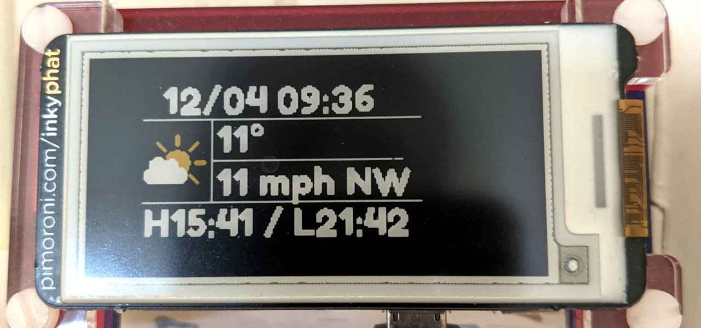
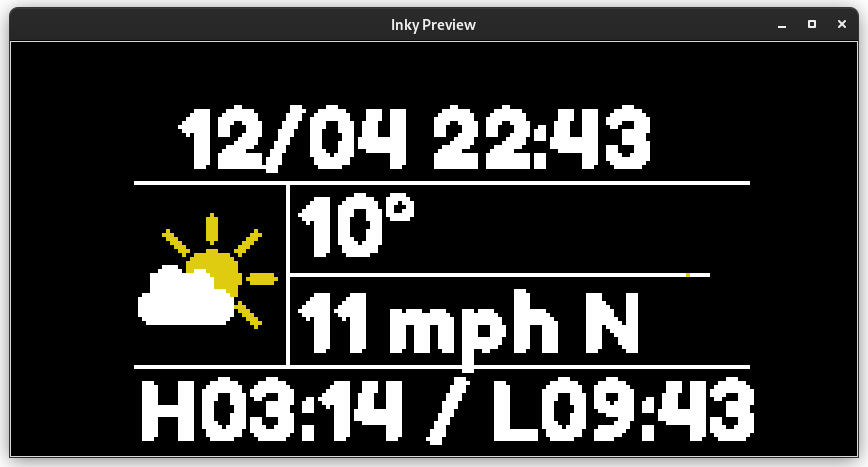

# Weather and tide time display

Using a [Raspberry Pi Zero W](https://www.raspberrypi.com/products/raspberry-pi-zero-w/) and an
[Inky pHAT](https://shop.pimoroni.com/products/inky-phat?variant=12549254905939) I am displaying my local weather
as well as my local (UK) tide times.

Based on the [weather-phat.py](https://github.com/pimoroni/inky/blob/master/examples/phat/weather-phat.py) example
script provided by Pimoroni. Additional documentation can be found
[here](https://learn.pimoroni.com/article/getting-started-with-inky-phat).



## Prequisites

- [Raspberry Pi Zero W](https://www.raspberrypi.com/products/raspberry-pi-zero-w/)
- [Inky pHAT Yellow/Black/White](https://shop.pimoroni.com/products/inky-phat?variant=12549254905939)
- Raspbian GNU/Linux 10 (buster)
- Python 3 (tested with 3.7 and 3.10)
- Optional: [Admiralty API key](https://admiraltyapi.portal.azure-api.net/signup/) for **UK Tidal API - Discovery**
- Optional: `tk` for local simulation

## Install

```bash
git clone git@github.com:tsak/weather-phat.git
cd weather-phat
python3 -m venv venv
source venv/bin/activate
python3 -m pip install -r requirements.txt
```

## Settings

Copy `.env.example` to `.env` and edit values.

```bash
CITY=London # City to use for geo location
COUNTRYCODE=GB # ISO country code for geo location
WARNING_TEMP=25.0 # Above this value the temparature will be displayed in Yellow or Red
ADMIRALTY_API_KEY= # Optional: Admiralty API key for UK tide times
ADMIRALTY_API_STATION_ID=0113 # Admiralty Tide time APIs station ID, e.g. `0113` for London, Tower Bridge
ADMIRALTY_API_HIGH_TIDE_CORRECTION=0 # Correction in minutes for High tide times, if you local beach is far from a station
ADMIRALTY_API_LOW_TIDE_CORRECTION=0 # Correction in minutes for Low tide times, if you local beach is far from a station
```

## Local simulation

```bash
./weather-phat.py --type phat --simulate --colour yellow
```



## Crontab

On the Raspberry Pi, I run the script every hour to update weather and tide times.

```
0 * * * * /usr/bin/python3 /home/pi/weather-phat.py
```
